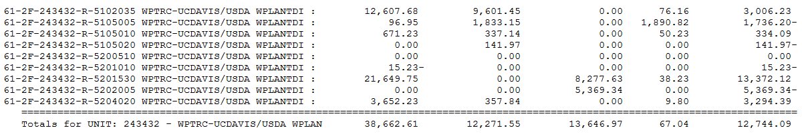

# Status of Attempts to Spend End-of-grant Funds from the Western Plant Diagnostic Network(WPDN)

University of Guam has participated in WPDN since 2004. The current 5 year grant which funds WPDN ends July 31, 2021, requiring all funds to be spent prior to this date. The latest report received for the WPDN account shows $13,647 remaining in the budget.
  

WPDN funds at UOG have been used to purchase supplies and equipment for the Plant Diagnostics Lab run by Bob Schlub and the Insect Pest Diagnostics Lab run by Aubrey Moore. Prior to his passing, WPDN partially funded Roger Brown's salary and travel money was provided for participation in the annual WPDN meeting. Remaining funding is largely a result of Roger Brown's passing and inability to travel due to CODID19.   
  
On May 22, Aubrey Moore, Bob Schlub and Julia Hudson had a Zoom meeting to put together a spending plan. We decided that approximately $10k would be used for equipment and supplies for Insect Diagnostics, $10k would be used for equipment and supplies for Plant Diagnostics, and remaining personnel funding would be used to support a student technician. We set about gathering quotes and submitted PO requests when these were ready.

## PO Requests from Insect Pest Diagnostics Lab (Aubrey Moore)

### PO request 1: Entomological supplies
  
* 2021-06-21: PO requested by [email](https://github.com/aubreymoore/WPDN/raw/main/procurement/history/req1.pdf). Included a quote for entomological supplies from Bioquip ($1054.02).
* 2021-06-28: Abstract Summary completed (7 days).
* 2021-07-07: PO 211614 received.
* 2021-07-14: Order placed online and paid for via credit card (Aubrey and Megumi)
* 2021-07-17: Order shipped.
* **STATUS: INCOMPLETE - Awaiting arrival of order.**

### PO request 2: Stereoscope

* 2021-06-21: PO requested by [email](https://github.com/aubreymoore/WPDN/raw/main/procurement/history/req1.pdf). Included a quote from the NY Microscope Co. ($2699.00) and 2 competative quotes.
* 2021-07-13: Abstract Summary completed (22 days).
* 2021-07-14: PO 211652 received. PO awarded to MegaByte($2975.00).
* 2021-07-19: PO sent to MegaByte (Megumi)
* **STATUS: INCOMPLETE - Awaiting arrival of order.**

### PO request 3: Inverted microscope
  
* 2021-06-21: PO requested by [email](https://github.com/aubreymoore/WPDN/raw/main/procurement/history/req1.pdf). Included a quote from the NY Microscope Co. ($3881.00) and 2 competative quotes.
* **STATUS: INCOMPLETE - Awaiting quote from a local vendor (MegaByte) prior to completing Abstract Summary.**

### PO request 4: Ethanol
  
* 2021-06-24: PO requested by [email](https://github.com/aubreymoore/WPDN/raw/main/procurement/history/req2.pdf). Included a quote for 2 barrels of ethanol from REMET ($1231.51).
* 2021-07-07: Abstract Summary completed (13 days).
* 2021-07-07: PO 211615 received.
* 2021-07-08: PO emailed to REMET (Aubrey)
* **STATUS: INCOMPLETE - Awaiting wire transfer of funds from UOG to REMET (Megumi).**

## PO Requests from Plant Diagnostics Lab (Julia Hudson)
  
### PO request 1: Lab supplies (Reaction Supply $14,000)
  
* 2021-06-22: Julia requested quote from Reaction Supply
* 2021-07-09: Quote rec'd; submitted for PO; rejected because of excessive amount. 
* 2021-07-12: Julia started collecting quotes to split up original quote
* **STATUS: REJECTED**

## PO request 2: Lab supplies: Bioquip ($1,469.26)

* 2021-07-15 PO requested
* 2021-07-15 PO rec'd
* 2021-07-16 order placesd online via credit card
*  **STATUS: Awaiting arrival of shipment**

## PO request 3: Lab supplies: Thomas Scientific ($1620.87) 
* 2021-07-15 PO requested
* 2021-07-19 PO rec'd
* 2021-07-19 Tried to order online; no shipping option available; PO emailed to Thomas Scientific
*  **STATUS: Awaiting response from Thomas Scientific**

## PO request 4: Lab supplies: Reaction Supply ($2400) 
* 2021-07-16 PO requested
* 2021-07-20 PO cancelled because vendor could not guarantee arrival of order before July 31
*  **STATUS: REJECTED**

## PO request 5: Lab supplies: Carolina Biological Supply ($2394.34) 
* 2021-07-16 PO requested
* 2021-07-20 PO rec'd
* 2021-07-20 Tried to order online; sent PO directly to company
* 2021-07-22 Corolina Biological replied that they could not ship specific items to Guam
*  **STATUS: PO Rejected by Carolina Biological Supply**

## PO request 6: Microscopy Supplies: Boli Optics ($659.08) 
* 2021-07-13 PO requested
* 2021-07-13 Julia requested info required to set up new vendor
* 2021-07-16 Company info for new vendor rec'd
* 2021-07-19 New vendor account created
* 2021-07-20 Po rec'd
* 2021-07-20 Attempted to order online; problem with credit card authentication
* 2021-07-20 Not enough time remaining for wire transfer
*  **STATUS: PO Abandonned becuase of purchasing delays**

## PO request 7: Lab supplies: Cole-Palmer ($2242.89) 
* 2021-07-16 PO requested
* 2021-07-20 PO rec'd
* 2021-07-20 Ordered online with credit card
* 2021-07-21 Order acknowledgement rec'd
*  **STATUS: Awaiting arrival of order**

## Personnel Amendment Request from Plant Diagnostics Lab (Julia Hudson)
  
* 2021-06-02 Request for personnel action emailed to CNAS-HR
* 2021-06-07 Julia drafted a memo asking transfer of Alex Chingyan to WPDN funds
* 2021-06-22 Response from CNAS-HR including copy of memo and a statement indicating that request was completed. Unfortunately, this was the wrong memo.
* 2021-06-28 CNAS signatures on oriiginal memo completed; forwarded to UOG-HRO
* 2021-07-15 Personnel request complete.
* **STATUS - COMPLETE** 
